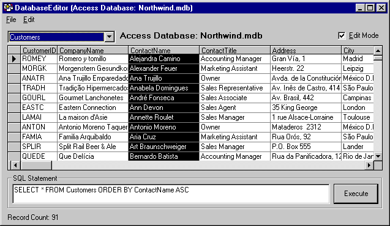



## ADO Database Viewer/Editor

### Description

Have you ever needed to view a database on a computer without MS Access? Here's an alternative. It uses ADO 2.1 to open, view & edit MS Access, SQL server, DSN and Oracle databases. There are also a few features to let you add, rename and delete tables as well as purge based on a Date/Time field. Clearly not a replacement for MS Access, but you can distribute it to help troubleshoot. Automatically registers itself as the default database viewer for .mdb files on systems without a default already set. Otherwise, it becomes a second option when right-clicking. Its Biggest advantage is its all ADO. No DAO at all. Now you're able to modify older versions of Access databases when Access itself requires a conversion!! I recommend distributing MDAC 2.5 even if you have a 2.1 application. Microsoft seems to have fixed some of the install problems with the MDAC 2.1. Please Note that you MUST HAVE the Oracle client installed on your PC to use the Oracle connection!!http://www.microsoft.com/data/download.htm

** Updated 3/21/2000 **Added Password support for Access databases.Please vote!
 
### More Info
 

             |
---                |---
**Submitted On**   |2000-04-22 10:43:32
**By**             |[Paul Mather](https://github.com/Planet-Source-Code/PSCIndex/blob/master/ByAuthor/paul-mather.md)
**Level**          |Intermediate
**User Rating**    |4.8 (560 globes from 116 users)
**Compatibility**  |VB 5\.0, VB 6\.0
**Category**       |[Databases/ Data Access/ DAO/ ADO](https://github.com/Planet-Source-Code/PSCIndex/blob/master/ByCategory/databases-data-access-dao-ado__1-6.md)
**World**          |[Visual Basic](https://github.com/Planet-Source-Code/PSCIndex/blob/master/ByWorld/visual-basic.md)
**Archive File**   |[CODE\_UPLOAD50754222000\.zip](https://github.com/Planet-Source-Code/paul-mather-ado-database-viewer-editor__1-6584/archive/master.zip)

